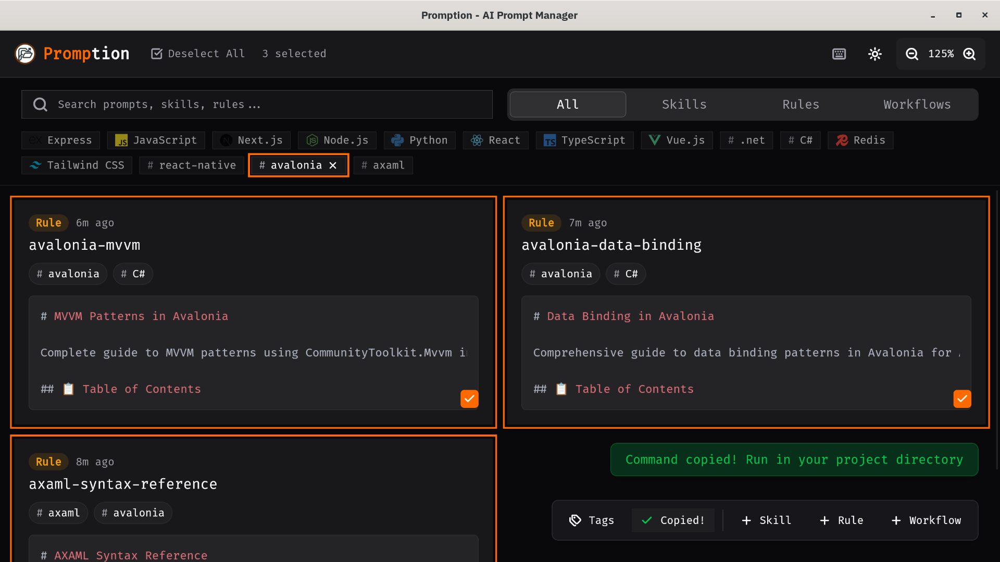
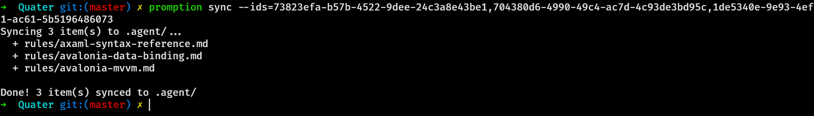

# Promption


[](https://github.com/Abdssamie/promption/releases)
[](https://github.com/Abdssamie/promption/actions)
[](LICENSE)

A desktop app + CLI for managing AI agent configurations across projects. Stop copy-pasting `.cursorrules`.

## The Problem

AI coding assistants (Cursor, Windsurf, OpenCode, etc.) use configuration files to guide their behavior. Managing these across multiple projects is painful:
- ❌ Manually copying configuration folders between projects
- ❌ Losing track of which configs work with which tech stacks
- ❌ No easy way to organize or search through your prompt library
- ❌ Difficult to share configurations with team members

## The Solution

**Promption** is your centralized library for AI context.



### Desktop App
- **Centralized Library**: Store all your skills, rules, and workflows in one place.
- **Smart Organization**: Tag by technology (React, Python, Rust, etc.).
- **Full-Text Search**: Find the right prompt instantly.
- **Privacy First**: All data stored locally in SQLite. No cloud, no tracking.

### CLI
Sync your configurations to any project with a single command.



```bash
# List your saved configurations
promption list

# Sync specific configs to your project (supports Cursor, Windsurf, OpenCode, etc.)
promption sync --ids=abc123,def456 --target=cursor
```

## Supported Tools

| Tool | Support | Output Location |
|------|---------|-----------------|
| **Antigravity** | ✅ | `.agent/` |
| **Cursor** | ✅ | `.cursor/rules/` & `.cursorrules` |
| **Windsurf** | ✅ | `.windsurf/rules/` & `.windsurf/skills/` |
| **OpenCode** | ✅ | `.opencode/rules/` & `.opencode/skills/` |
| **Cline** | ✅ | `.clinerules/` & `.cline/skills/` |
| **GitHub Copilot** | ✅ | `.github/copilot-instructions.md` |

## Installation

### Pre-built Binaries (Recommended)
Download the latest version for macOS, Linux, and Windows from [Releases](https://github.com/Abdssamie/promption/releases).

### Build from Source

```bash
git clone https://github.com/Abdssamie/promption.git
cd promption
bun install
bun run tauri build
```

**Requirements:** [Rust](https://rustup.rs/), [Node.js](https://nodejs.org/), [Bun](https://bun.sh/).

## Usage

1.  **Launch Promption** and add your favorite rules (e.g., "React Best Practices", "Python Typing").
2.  **Tag them** for easier filtering.
3.  **Select items** you want to use in your current project.
4.  **Click "Copy Cmd"** or run `promption list` to get IDs.
5.  **Run the sync command** in your project root:
    ```bash
    promption sync --ids=... --target=windsurf
    ```

## Keyboard Shortcuts

| Shortcut | Action |
|----------|--------|
| `Ctrl+N` | New skill |
| `Ctrl+Shift+S/R/W` | New skill/rule/workflow |
| `Ctrl+F` | Focus search |
| `Ctrl+C` | Copy sync command |

## Tech Stack

- **Core**: Tauri v2, Rust
- **Frontend**: React 19, TypeScript, Vite, TailwindCSS v4, Shadcn/UI
- **Database**: SQLite

## Contributing

Contributions are welcome! See [CONTRIBUTING.md](CONTRIBUTING.md) for setup instructions.

## License

[MIT](LICENSE)
